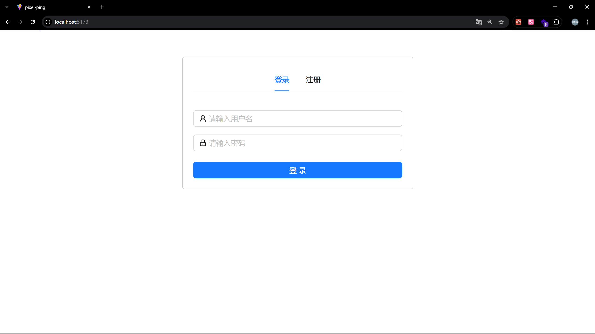
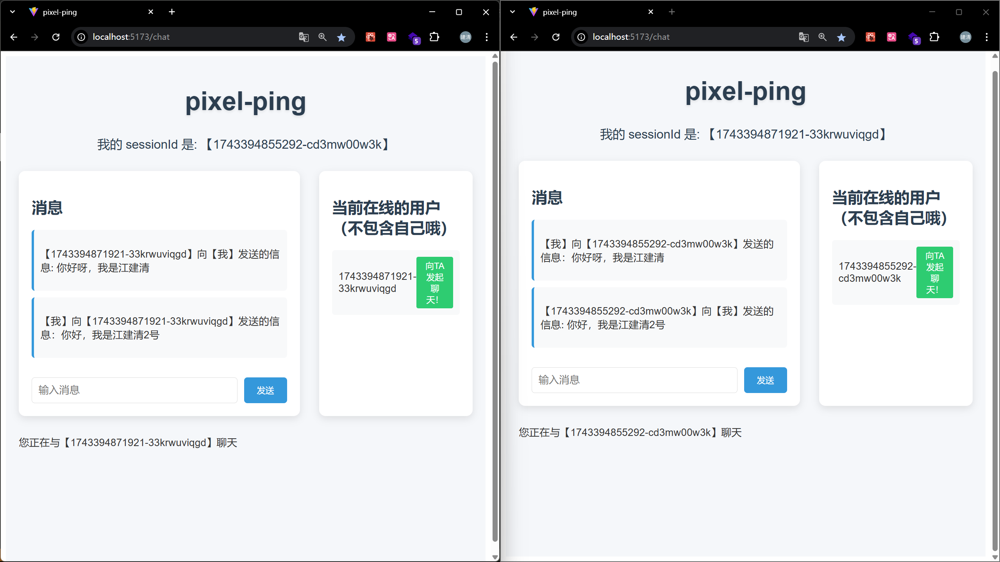

    

<h1 align="center">pixel-ping</h1>

## 项目简介
本项目是一个聊天室项目，可实现一对一聊天。

## 技术选型
### 前端
React、Vite、Ant Design、TypeScript、Axios
### 后端
Express、TypeScript、Prisma、WebSocket (ws)、Tsoa

## 项目运行图片

    

        <h4>登录界面</h4>
        
    

    

        <h4>聊天界面</h4>
        
    

## 许可证

本项目采用 [MIT License](https://opensource.org/licenses/MIT) 许可证，详情请查看 [LICENSE](./LICENSE) 文件。