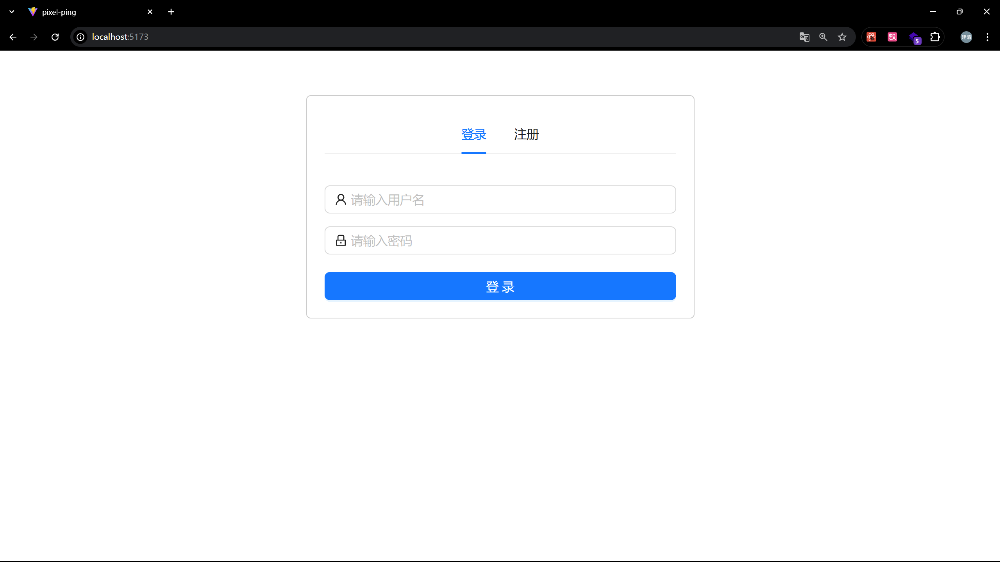
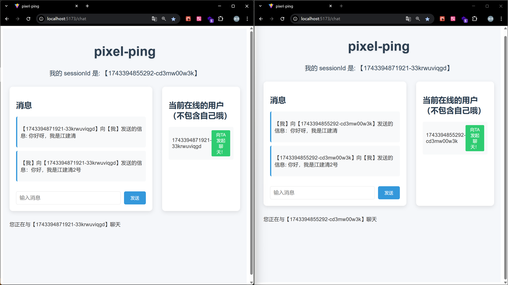

<div align="center">
    
</div>
<h1 align="center">pixel-ping</h1>

## 项目简介

本项目是一个聊天室项目，可实现一对一聊天。

## 快速启动

1. 补全前后端的.env 文件，可参考.env.sample 文件
2. 启动数据库服务并运行后端
    ```bash
    pnpm i
    pnpm prisma generate # 生成 Prisma 客户端
    ./start-db-and-backend.sh
    ```
3. 启动前端服务
    ```bash
    cd browser
    pnpm install
    pnpm run dev
    ```
4. 访问`http://localhost:5173`，使用默认账号密码`admin`、`admin123`登录

## 技术选型

### 前端

React、Vite、Ant Design、TypeScript、Axios

### 后端

Express、TypeScript、Prisma、WebSocket (ws)、Tsoa

## 项目运行图片

<div align="center">
    <div>
        <h4>登录界面</h4>
        
    </div>
    <div>
        <h4>聊天界面</h4>
        
    </div>
</div>

## 许可证

本项目采用 [MIT License](https://opensource.org/licenses/MIT) 许可证，详情请查看 [LICENSE](./LICENSE) 文件。
